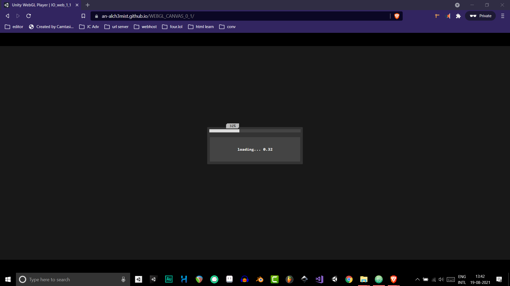

```css
               ._content
                {
                        transform: none !important;
                        left: 0px !important;
                        top: 0px !important;
                }

                ._container
                {
                        width: 100vw !important;
                        height: 100vh !important;

                        overflow: hidden !important;
                        display: flex !important;
                        justify-content: center;
                        align-items: center !important;
                        background-color: #000 !important;
                }

                canvas
                {

                        width: 100vw !important;
                        /* max-width: 80rem !important; */
                        height: calc(100vw * 0.42) !important;
                        display: block !important;
                        background-color: #222 !important;
                }

                ._hide
                {
                        display: none !important;
                }

```

<br>

```html
        <div class="webgl-content _content">
                <div id="gameContainer" class="_container" style="width: 1000px; height: 300px">


                </div>

                <div class="footer _hide">
                        <div class="webgl-logo"></div>
                        <div class="fullscreen" onclick="gameInstance.SetFullscreen(1)"></div>
                        <div class="title">IO_web_1_1</div>
                </div>
        </div>

```

<br>
<br>
<br>


<h1>_LOADING_</h1>
<br>
  
<h3>_LOADING_TEMPLATE_0</h3>
  
```js
  
   let _loading_bar;
   let _loading_status;


   let start = true;
   let stop_loading = false;
  
   function _LOADING_(x)
   {
           if (start)
           {
                   _loading_bar = document.querySelector("._BOX_0_0_0_0");
                   _loading_status = document.querySelector("._BOX_0_0_1_0");


                   start = false;
           }


           if (x == 1)
           {

                   let _BOX_0 = document.querySelector("._BOX_0");
                   let _BOX_0_0 = document.querySelector("._BOX_0_0");


                   let animate_1 = _BOX_0_0.animate(
                           [
                                   // keyframes
                                   {
                                           transform: 
                                              "translate(0px , -60%) scale(100%)"
                                   },
                                   {
                                           transform: 
                                              "translate(0 , calc(-60% + 600px)) scale(100%)",
                                           opacity: 1
                                   }
                           ],
                           {
                                   // timing options
                                   delay: 60,
                                   fill: "forwards",
                                   duration: 800,
                                   easing: "cubic-bezier(0.7, 0, 1, 1)"
                           }
                   );


                   animate_1 = _BOX_0.animate(
                           [
                                   {
                                           backgroundColor: "rgba(0,0,0,0.9)"
                                   },
                                   {
                                           backgroundColor: "rgba(0,0,0,0.0)"
                                   }

                           ],
                           {
                                   // timing options
                                   fill: "forwards",
                                   duration: 1200,
                                   easing: "cubic-bezier(0.9, 0, 1, 1)"
                           }

                   )

                   animate_1.onfinish = function()
                   {
                           _BOX_0.style.display = "none";
                   }

           }
           //


           let _value = x / 0.85;
           if (_value > 1.0)
           {
                   // stop_loading
                   if (!stop_loading)
                   {

                           let _animate = _loading_bar.animate(
                                   [
                                           // keyframes
                                           {
                                                   width: _loading_bar.style.width
                                           },
                                           {
                                                   width: "100%"
                                           }
                                   ],
                                   {
                                           // timing options
                                           fill: "forwards",
                                           duration: 400,
                                           easing: "ease-in-out",
                                   }
                           );


                           _value = 1.0;

                           _loading_status.innerHTML =
                              "loading.. " + _value.toFixed(2).toString() + "/" + "1.00";
                           _loading_bar.setAttribute(
                              "_attr", Math.round(_value * 100).toString() + "%");


                           _animate.onfinish = function()
                           {
                                   _loading_status.innerHTML = "extracting.. ";
                           }

                           stop_loading = true;
                   }
                   //

           }


           //
           if (!stop_loading)
           {
                   _loading_status.innerHTML =
                          "loading.. " + _value.toFixed(2).toString() + "/" + "1.00";
                   _loading_bar.setAttribute(
                          "_attr", Math.round(_value * 100).toString() + "%");

                   _loading_bar.animate(
                           [
                                   // keyframes
                                   {
                                           width: _loading_bar.style.width
                                   },
                                   {
                                           width: (_value * 100).toString() + "%"
                                   }
                           ],
                           {
                                   // timing options
                                   fill: "forwards",
                                   duration: 900,

                           }
                   );
           }
           //


   }


```

<br>
<h3>_LOADING_TEMPLATE_1</h3>

```js

   let _loading_bar;
   let _loading_status;


   let start = true;
   let stop_loading = false;
   
   function _LOADING_(x)
   {
           if (start)
           {
                   _loading_bar = document.querySelector("._BOX_0_0_0_0");
                   _loading_status = document.querySelector("._BOX_0_0_1_0");


                   start = false;
           }


           if (x == 1)
           {

                   let _BOX_0 = document.querySelector("._BOX_0");
                   let _BOX_0_0 = document.querySelector("._BOX_0_0");


                   let animate_1 = _BOX_0_0.animate(
                           [
                                   // keyframes
                                   {
                                           transform: "translate(0px , -60%) scale(100%)"
                                   },
                                   {
                                           transform: "translate(0 , calc(-60% + 600px)) scale(100%)",
                                           opacity: 1
                                   }
                           ],
                           {
                                   // timing options
                                   delay: 60,
                                   fill: "forwards",
                                   duration: 800,
                                   easing: "cubic-bezier(0.7, 0, 1, 1)"
                           }
                   );


                   animate_1 = _BOX_0.animate(
                           [
                                   {
                                           backgroundColor: "rgba(0,0,0,0.9)"
                                   },
                                   {
                                           backgroundColor: "rgba(0,0,0,0.0)"
                                   }

                           ],
                           {
                                   // timing options
                                   fill: "forwards",
                                   duration: 1200,
                                   easing: "cubic-bezier(0.9, 0, 1, 1)"
                           }

                   )

                   animate_1.onfinish = function()
                   {
                           _BOX_0.style.display = "none";
                   }

                   return;
           }
           //
           
           
           
          if(!stop_loading)
          {
         
                   let _value = x / 0.85;
                   if (_value > 1.0)
                   {
                      _value = 1.0;
                      stop_loading = true;
                   }


                   _loading_status.innerHTML = "loading.. " + _value.toFixed(2).toString() + "/" + "1.00";
                   _loading_bar.setAttribute("_attr", Math.round(_value * 100).toString() + "%");

                   let _animate = _loading_bar.animate(
                           [
                                   // keyframes
                                   {
                                           width: _loading_bar.style.width
                                   },
                                   {
                                           width: (_value * 100).toString() + "%"
                                   }
                           ],
                           {
                                   // timing options
                                   fill: "forwards",
                                   duration: 900,

                           }
                   );

                  if(stop_loading)
                  {
                      _animate.onfinish = function()
                      {
                           _loading_status.innerHTML = "extracting..";
                      }
                  }
          }
          //
   }


```


<br>
<h3>_LOADING_TEMPLATE_2</h3>

```js
   let _loading_bar;
   let _loading_status;


   let start = true;
   
   
   function _LOADING_(x)
   {
           if (start)
           {
                   _loading_bar = document.querySelector("._BOX_0_0_0_0");
                   _loading_status = document.querySelector("._BOX_0_0_1_0");


                   start = false;
           }


           if (x == 1)
           {

                  _BOX_0.style.display = "none";
                  return;
           }
           //
           
           
           


           let _value = x / 0.85;
           if (_value > 1.0)
           {
              _value = 1.0;
           }
           
           
           
           _loading_status.innerHTML = "loading.. " + _value.toFixed(2).toString() + "/" + "1.00";
           _loading_bar.setAttribute("_attr", Math.round(_value * 100).toString() + "%");

           _loading_bar.animate(
                   [
                           // keyframes
                           {
                                   width: _loading_bar.style.width
                           },
                           {
                                   width: (_value * 100).toString() + "%"
                           }
                   ],
                   {
                           // timing options
                           fill: "forwards",
                           duration: 900,

                   }
           );


   }


```


<br>
<br>
<br>
<br>


```js
function UnityProgress(gameInstance, progress)
{
      if (!gameInstance.Module)
            return;

      if (!gameInstance.logo)
      {
            gameInstance.logo = document.createElement("div");
            gameInstance.logo.className = "logo " + gameInstance.Module.splashScreenStyle;


            //.......................
            //            gameInstance.container.appendChild(gameInstance.logo);
            //.......................

      }

      if (!gameInstance.progress)
      {
            gameInstance.progress = document.createElement("div");
            gameInstance.progress.className = "progress " + gameInstance.Module.splashScreenStyle;
            gameInstance.progress.empty = document.createElement("div");
            gameInstance.progress.empty.className = "empty";
            gameInstance.progress.appendChild(gameInstance.progress.empty);
            gameInstance.progress.full = document.createElement("div");
            gameInstance.progress.full.className = "full";

            gameInstance.progress.appendChild(gameInstance.progress.full);


            //.......................
            //          gameInstance.container.appendChild(gameInstance.progress);
            //.......................


      }


      //.......................
      _LOADING_(progress);
      //.......................


      gameInstance.progress.full.style.width = (100 * progress) + "%";
      gameInstance.progress.empty.style.width = (100 * (1 - progress)) + "%";
      if (progress == 1)
            gameInstance.logo.style.display = gameInstance.progress.style.display = "none";
}

```

<br>
<br>
<br>
<br>




```css

                ._BOX_0
                {
                        position: absolute;
                        width: 100vw;
                        height: 100vh;
                        background-color: rgba(0, 0, 0, 0.8);

                        margin: 0px;
                        padding: 0px;
                        left: 0px;
                        top: 0px;

                        z-index: 100;

                        display: flex;
                        justify-content: center;
                        align-items: center;


                        --a: #333;
                        --b: #444;
                        --c: #ddd;
                        --d: #444;
                        --e: #eee;

                        /**/
                        overflow: hidden;
                }

                ._BOX_0_0
                {
                        width: 30vw;
                        min-width: 12rem;
                        max-width: 18rem;
                        height: 7rem;
                        background-color: var(--a);

                        border-radius: 2px;
                        display: flex;
                        justify-content: center;
                        flex-direction: column;

                        transform: translate(0px, -60%);
                }


                ._BOX_0_0_0
                {
                        height: 0.7rem;
                        margin: 0.4rem;
                        width: calc(100%-1rem);

                        background-color: var(--b);
                        border-radius: 1px;
                }

                /**/
                ._BOX_0_0_0_0
                {
                        height: 100%;
                        width: 0%;
                        background-color: var(--c);

                        /*
                        --_a: hsla(120, 00%, 100%, 1);
                        --_b: hsla(360, 50%, 50%, 1);
                        background: repeating-linear-gradient
                        (-45deg,
                        var(--_a) 0,
                        var(--_a) 5px,
                        var(--_b) 5px,
                        var(--_b) 12px);
                        */
                        border-right: 2px solid #eee;
                        position: relative;
                }

                ._BOX_0_0_0_0::after
                {
                        content: attr(_attr);
                        width: 2.2rem;
                        /*  height: 0.8rem;*/

                        background: #bbb;
                        color: #111;
                        position: absolute;
                        right: -1px;
                        top: 0px;
                        transform: translate(0px, calc(-100% - 2px));

                        padding: 1px 3px;
                        margin: 0px;

                        font-family: consolas;
                        font-weight: bold;
                        font-size: 0.7rem;
                        text-align: center;

                        --_bevel: 4px;
                        clip-path: polygon(var(--_bevel) 0px, 100% 0px,
                                        100% calc(100% - var(--_bevel)),
                                        calc(100% - var(--_bevel)) 100%,
                                        0% 100%, 0% var(--_bevel));
                }


                ._BOX_0_0_1
                {
                        height: 5rem;
                        margin: 0.5rem;
                        width: calc(100%-1rem);
                        background-color: var(--d);

                        border-radius: 1px;

                        display: flex;
                        justify-content: center;
                        align-items: center;
                }

                /**/
                ._BOX_0_0_1_0
                {
                        background-color: var(--d);
                        border-radius: 3px;

                        color: var(--e);
                        padding: 0.2rem 0.5rem 0.2rem 0.5rem;


                        font-family: consolas;
                        font-weight: bolder;
                        font-size: 0.8rem;

                }


```


```html

        <div class="_BOX_0">
                <div class="_BOX_0_0">
                        <div class="_BOX_0_0_0">
                                <div class="_BOX_0_0_0_0" _attr="0%">
                                </div>
                        </div>
                        <div class="_BOX_0_0_1">
                                <div class="_BOX_0_0_1_0">
                                        loading... 0.12
                                </div>
                        </div>
                </div>
        </div>

```


